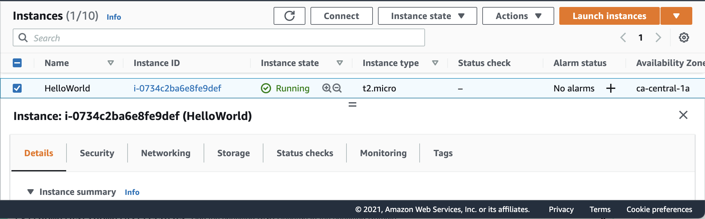

# HelloWorld

:round_pushpin: Create a linux `Ubuntu` 20.0.4LTS Instance

`main.tf` Terraform - `HashiCorp Configuration Language` (HCL) script

```hcl
provider "aws" {
 region = "ca-central-1"
}

resource "aws_instance" "helloworld" {
  ami = "ami-043e33039f1a50a56"
  instance_type = "t2.micro"
  tags = {
    Name = "HelloWorld"
  }
}
```

- [ ]  Init

```
terraform init
```

- [ ] Apply

```
terraform apply
```
> Validation
```
 Do you want to perform these actions?
   Terraform will perform the actions described above.
   Only 'yes' will be accepted to approve.
 
   Enter a value: yes
```

 </img>

- [ ] Show

```
terraform show
```

- [ ] Destroy

```
terraform destroy
```
> Validation
```
Do you really want to destroy all resources?
  Terraform will destroy all your managed infrastructure, as shown above.
  There is no undo. Only 'yes' will be accepted to confirm.

  Enter a value: yes
```

* Still deleting

> Deleting
```
aws_instance.helloworld: Destroying... [id=i-0734c2ba6e8fe9def]
aws_instance.helloworld: Still destroying... [id=i-0734c2ba6e8fe9def, 2m10s elapsed]
...
aws_instance.helloworld: Destruction complete after 2m12s

Destroy complete! Resources: 1 destroyed.
```

