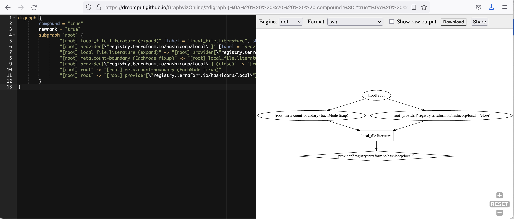

# Local File

- [ ] Enable Trace

```
export TF_LOG=trace
```

- [ ] Disable Trace

```
unset TF_LOG
```

:a: Plan

- [ ] Save the plan in binary file

```
terraform plan -out plan.out
```

- [ ] Show the saved plan in `json`

```
terraform show -json plan.out > plan.json
```

* show the `json` file

```
jq . plan.json
```

```
jq .terraform_version plan.json --raw-output
```
> 1.0.11

- [ ] Run the saved plan

```
terraform apply "plan.out"
```

- [ ] Run in [parallel](https://www.terraform.io/docs/cli/commands/apply.html#parallelism-n)

* Default 10

```
terraform plan -parallelism=8 
```

 - [ ] Run the `dependency` graph

```
terraform graph
```
> Return
```
digraph {
	compound = "true"
	newrank = "true"
	subgraph "root" {
		"[root] local_file.literature (expand)" [label = "local_file.literature", shape = "box"]
		"[root] provider[\"registry.terraform.io/hashicorp/local\"]" [label = "provider[\"registry.terraform.io/hashicorp/local\"]", shape = "diamond"]
		"[root] local_file.literature (expand)" -> "[root] provider[\"registry.terraform.io/hashicorp/local\"]"
		"[root] meta.count-boundary (EachMode fixup)" -> "[root] local_file.literature (expand)"
		"[root] provider[\"registry.terraform.io/hashicorp/local\"] (close)" -> "[root] local_file.literature (expand)"
		"[root] root" -> "[root] meta.count-boundary (EachMode fixup)"
		"[root] root" -> "[root] provider[\"registry.terraform.io/hashicorp/local\"] (close)"
	}
}
```

https://dreampuf.github.io/GraphvizOnline

 </img>


